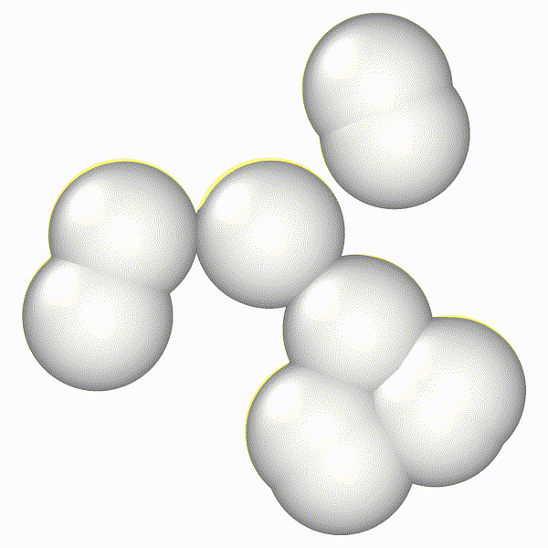

# md-lv
Simulation code of overdamped Langevin dynamics with periodic boundary conditions in Rust. This code implements a basic simulation mode, as well as a gradient-descent based equilibration/quenching and the Chen and Horing method for biasing of the system potential. Due to the lack of internal neighbor data this code is meant to be run on quite small systems (N < 100). The binary `md-lv` is the main executable from which simulations are run. The `scripts` directory contains workflows for automating simulation execution, and `notebooks` contains code for the post-processing analysis.



# Building
Building md-lv just requires `cargo`, which is easily obtained by download `rustup` from 

```bash
cargo build --release
```

Additionally the binary can be installed in the `$PATH` by running

```bash
cargo install --path .
```

# Usage Description

Simply execute `./target/release/md-lv` to run a basic simulation. CLI parameters can be shown with the `--help` flag.